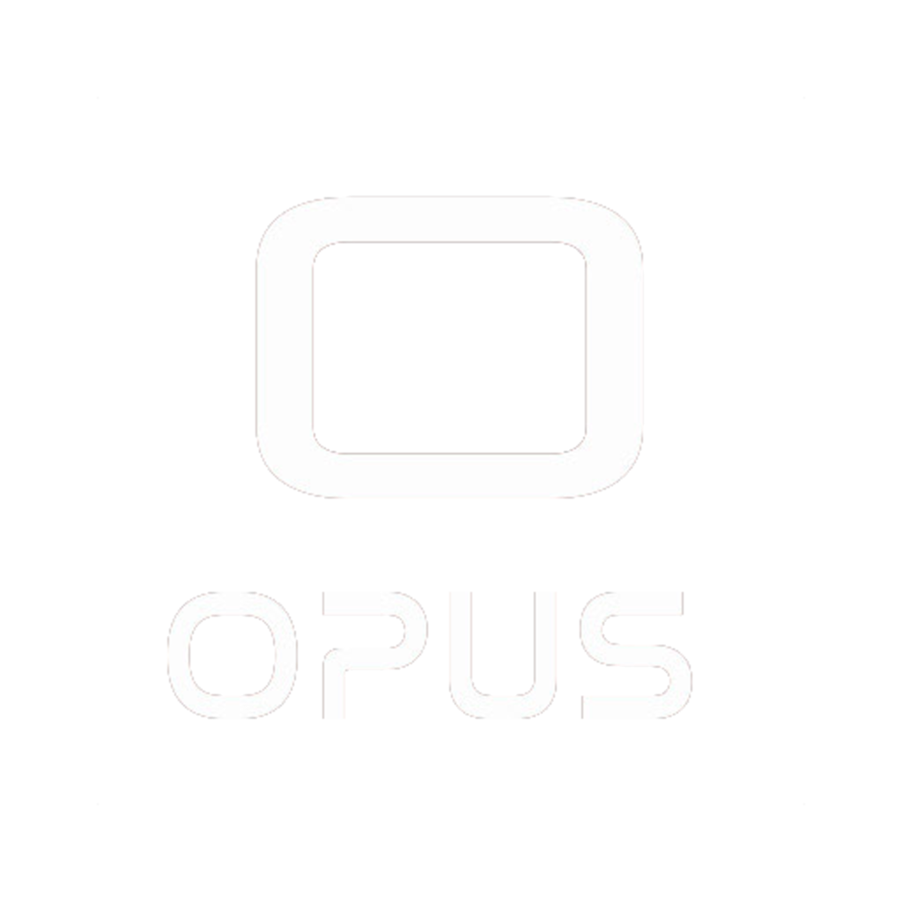

<h1 align="center"> 
 
    
 
 
Opus
</h1>

This was officially my first project, my completion of the course. An application developed for freelancers, so they can advertise their services for free. I hope you enjoy it. 

    
    

## :rocket: Technologies

This project was developed with the following technologies:

- :heavy_check_mark: React Native
- :heavy_check_mark: PHP
- :heavy_check_mark: MySql