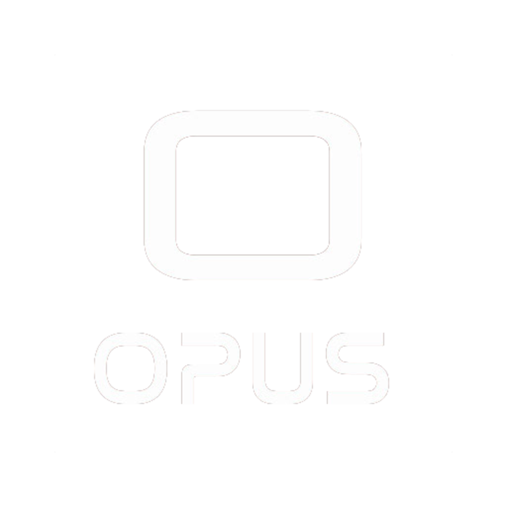
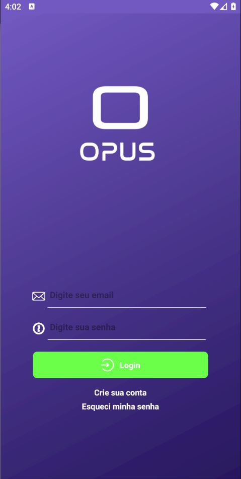
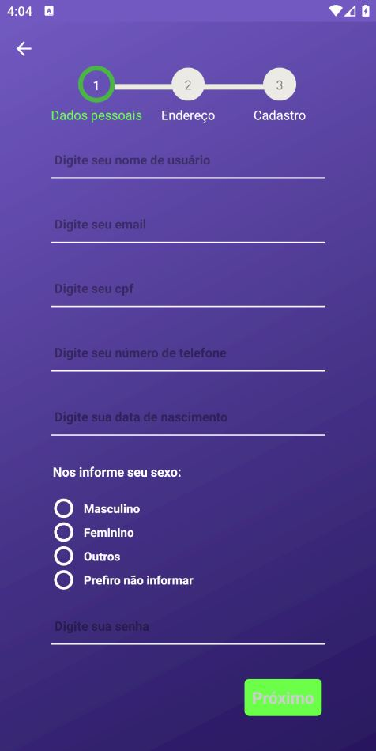

<h1 align="center">
   
  
    
   
</h1>

  
  
  

  My first complete project — a mobile app built for freelancers to advertise their services for free, connecting professionals with clients in a simple and accessible way.

---

## 📸 Preview

  
  

---

## 🚀 Tech Stack

| Technology | Role |
|---|---|
|  | Mobile frontend |
|  | Backend & REST API |
|  | Relational database |

---

## ✨ Features

- 📋 Freelancer registration and profile creation
- 🔍 Service listing and discovery
- 🔐 Authentication (login / sign up)
- 💼 Free service advertising for professionals

---

## 🎯 About the Project

Opus was built as my **course completion project**, the first full application I developed from scratch. The goal was to create a platform where freelancers could register and showcase their services without any cost, making it accessible to independent professionals at any stage of their careers.

---

## 📄 License

This project is for educational purposes.
